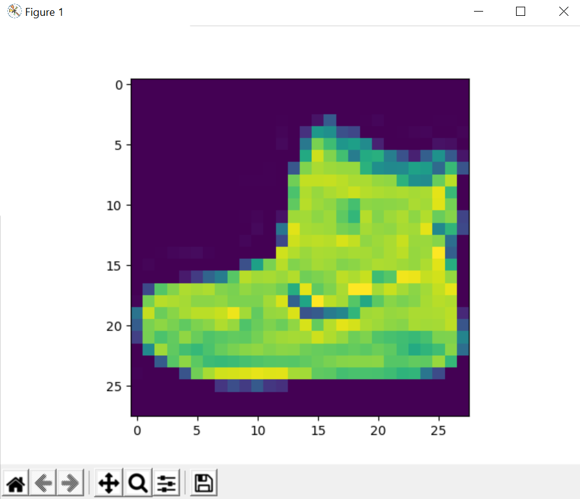
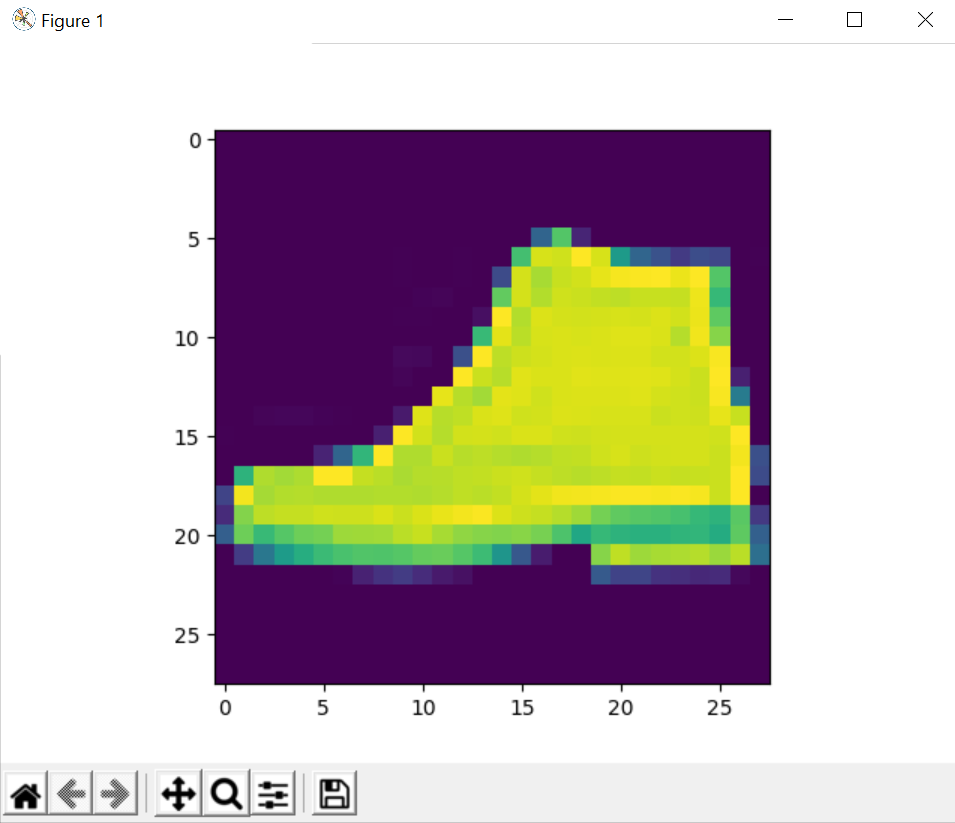

## Description
Uses TensorFlow and tf.keras to create a machine learning model which identify articles of clothing (in this example, shoes).

## Example Images

> here are two of the over 70,000 images that the model processes from the FashionMNIST dataset:


#



### Results

> As you can see here, the model does 5 passes (epochs) when it trains on the data set and its penalty (loss) in each run

```bash
Epoch 1/5
1875/1875 [==============================] - 3s 2ms/step - loss: 0.5026 - accuracy: 0.8252
Epoch 2/5
1875/1875 [==============================] - 3s 2ms/step - loss: 0.3776 - accuracy: 0.8635
Epoch 3/5
1875/1875 [==============================] - 3s 2ms/step - loss: 0.3360 - accuracy: 0.8770
Epoch 4/5
1875/1875 [==============================] - 3s 2ms/step - loss: 0.3128 - accuracy: 0.8861
Epoch 5/5
1875/1875 [==============================] - 3s 2ms/step - loss: 0.2957 - accuracy: 0.8898
313/313 [==============================] - 0s 1ms/step - loss: 0.3498 - accuracy: 0.8706
```
> It tests itself in the last line and gets 87% accuracy!
